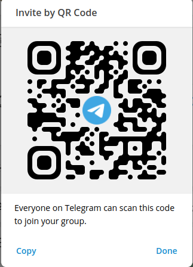
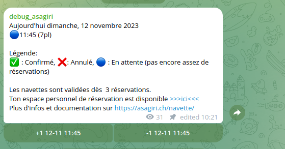
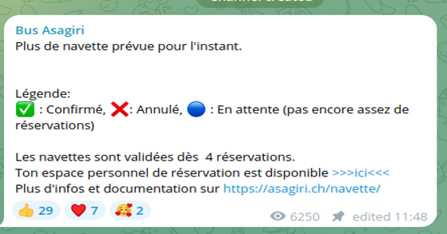
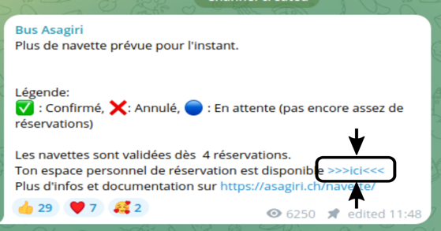
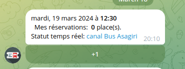

# Introduction

NavBot is a python based telegram bot used to schedule and manage shuttles booking.

It is intended to be used as follow:
1. The user joins a channel where the schedule shuttles are listed. This channel contains **only one mesage** which is automatically updated by the application.
2. The user opens a link (as suggested in the channel pinned message) to a private chat with the bot.
3. The user can click on the +1 button to book a shuttle or click on -1 to cancel a booking.


*Note: This application is currently deployed for the Asagiri shuttles. The screenshots used for this documentation refers to this usecase. However, it  can easily be adapted to any other purpose.*

# User manual

## User setup (Asagiri use case)

1. The user joins the dedicated channel (from the qrcode or the [invite link](https://t.me/+Yg0MmZnTZG44YThk)) and can follow the shuttle state.
2. The user joins the private chat with the bot and can manage its booking from there.




*Qr-code invitation to the channel*

## :eyes: telegram screenshots







## User manual

Once the user is part of the channel and has open the private chat with the bot, it will be notified each time a new shuttle is added in the private chat.

- The user can book one or several seats (under reserved that there is still free seats in the shuttle) by clicking on the dedicated <kbd>+1</kbd> button.
- The user can cancel its booking by blicking on the dedicated <kbd>-1</kbd>  button.
- The number of reserved seats for the user is available in the private chat. The status of the shuttle (`confirmed`, `not enough booking yet`, `cancelled`) is  only available in the channel message.


### Legacy mode

The user can still book or cancel a shuttle using the cli mode with the following syntax: `<+-> <nb> [day] <hour>`

For example: 

- `+1 10:30` to book one seat today at 10h30, `-1 10:30` to cancel one seat.
- `+3 10:30` to book three seats today at 10h30, `-2 10:30` to cancel two of the three seats.
- `+1 10-01 10:30` to book one seat on january 10 at 10h30, `-1 10-01 10:30`.

## Administrator and/or driver manual

The administrator can add, cancel and see the booking status of the scheduled shuttles.
All the administration part is done in the privated chat.

- Add a new shuttle: `/addnav [day] <hour>`.  The `[day]` argument can be ommited if the shuttle is planned today. Example: `/addnav 10-01 12:30`
to book a shuttle on january 10, at 12h30, `/addnav 12:30` to add a shuttle today at 12h30.
- Add several shuttles the same day: `/addnav 10-01 12:30 13:15 14:00`.
- Cancel or remove a shuttle: `/removenav [day] <hour>`. Example: `/removenav 10-01 12:30` .
- Check the booking status: `/status` for all the shuttles, or `/status [day] <hour>` for a given shuttle.
- Perform a refresh of the channel message: `/refresh`

**Warning: the administrator must always communicate in the private chat, and never in the channel.**


# Deployment

This deployment setup has been tested on a ubuntu 22.04 server. The application needs the following servicees:

- A dedicated telegram bot
- A dedicated telegram channel
- A dedicated python3 virtualenv
- A mysql/mariadb database (with stored procedures capability)

The directories used for this application are: 

- The source files are located in the `/usr/share/navbot` directory.
- The log files are located in the `/var/log/navbot` directory.

A dedicated `navbotuser` user is used here. It is assumed that this user as RW access to the application related files.

## Create the telegram bot

See [here](https://telegram.me/BotFather)

## Create the dedicated telegram channel

See telegram doc to create a telegram channel

## Create the log file

```bash
touch /var/log/navbot.log
```

## Setup the python virtual environment

```bash
mkdir /usr/share/navbot
cd /usr/share/navbot
mkdir venv
python3 -m venv venv
source venv/bin/activate
pip3 install -r requirements.txt

```

## Setup the database

- Create the user, database and assign rights using the mysql console `sudo mysql`

```mysql
CREATE DATABASE navbot;
CREATE USER 'navbot_bot'@'localhost' IDENTIFIED BY 'passwdhere';
GRANT ALL PRIVILEGES ON navbot.* TO 'navbot_bot'@'localhost';
```

- Create the tables and the stored procedures: `sudo mysql navbot < helpers/navbot_setup.sql`

## Configure the .env file

The environment variables files contains all the secret credentials used by the application.

1. Fill the `template.env file`
2. `mv template.env .env`

## Test that the application is working

```bash
cd /usr/share/navbot
./venv/bin/python3 main.py
```

Then, kill the application.


## Add a systemd entry to run the bot as a service


```bash
cat > /etc/systemd/system/navbot.service <<EOF
[Service]
ExecStart=/usr/share/navbot/venv/bin/python3 main.py
Restart=always
User=navbotuser
# Note Debian/Ubuntu uses 'nogroup', RHEL/Fedora uses 'nobody'
Group=nogroup
Environment=PATH=/usr/bin:/usr/local/bin
Environment=NODE_ENV=production
WorkingDirectory=/usr/share/navbot

[Install]
WantedBy=multi-user.target
EOF

# Enable the service and start it at boot
sudo systemctl enable --now navbot.service
# Check the service status
sudo systemctl status navbot.service
```


## Optional:  Monitor the logs in real time

```bash
tail -f /var/log/navbot.log
```

# Contributing

All new ideas and pull requests are welcome.

Please also consider buy the developer a coffee using the donate button below.

[](https://www.paypal.com/donate/?hosted_button_id=7U5L2U84YAELC)

